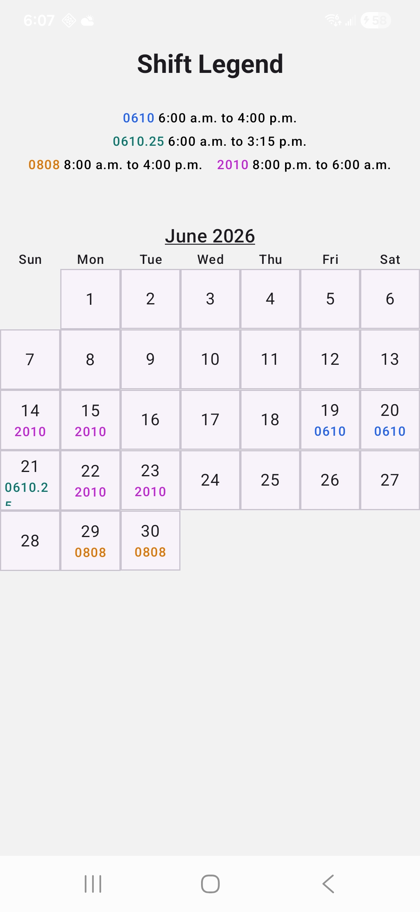
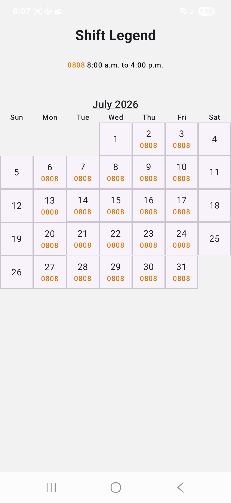
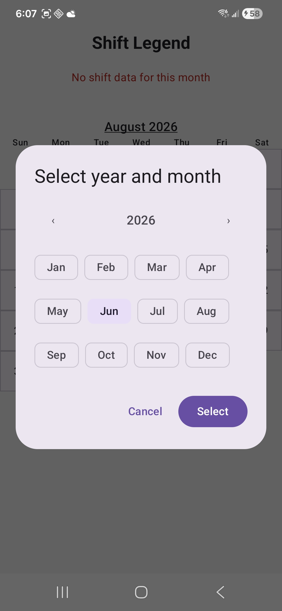
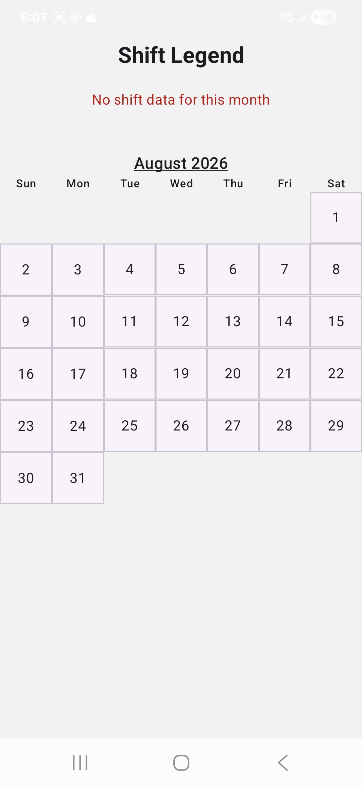
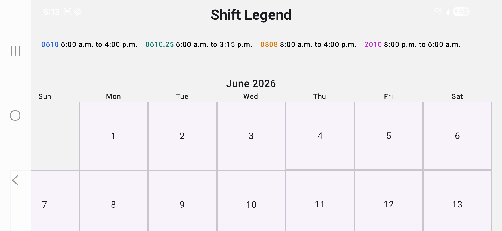
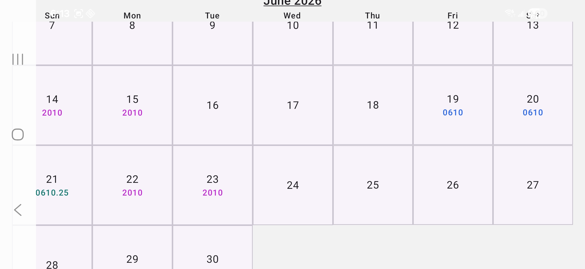
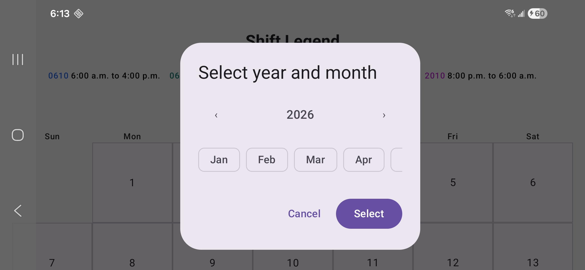

<!-- TABLE OF CONTENTS --> 
<h1>Readme to do at a later date</h1>

<section>
    <h1>Table of Contents</h1>
    <article>
        <ol>
            <li><a href="#about" title="About this application and why I created it">About</a></li>
            <li><a href="#features" title="A list of features included in this application">Features</a></li>
            <li><a href="#screenshots" title="A list of screenshots for both portrait and landscape mode">Screenshots</a></li>
            <li><a href="#used" title="Things used in this application">Used</a></li>
            <li><a href="#credits" title="Credits to give to assets that I used">Credits</a></li>
        </ol>
    </article>
</section>

<section>
    <!-- ABOUT SECTION -->
    <h3 id="about">About</h3>
    <article>
        

            Because I work shift work, I decided to make an app for friends and family which will show the shifts worked for that month. 
            I enter all my shift data on Firebase, and the app reads from that. Data is stored locally once shift data has been read at least once 
            from Firebase in case the user is ever offline. 
        

        

            <a href="#readme-top">Back to top</a>
        

    </article>
</section>

<section>
    <!-- FEATURES SECTION -->
    <h3 id="features">Features</h3>
    <article>
        

            Below are a list of features that I included, as is most likely expected from a mobile app created in 2026:
        

        <ul>
            <li>Consistent look in both portrait and landscape mode</li>
            <li>Consistent look in both light and dark mode</li>
            <li>Dynamically changing calendar that generates x number of cells to represent calendar, where x is the number of days that month</li>
            <li>Dynamically updating shift legend which shows definitions for shift codes, only showing definitions for shift codes used that month</li>
            <li>Dialog selector for selecting both month and year when clicking on underlined label on top of calendar</li>
            <li>Two second attempt to access month data from Firebase, before resorting to locally stored month data</li>
        </ul>
        

            <a href="#readme-top">Back to top</a>
        

    </article>
</section>

<section>
    <!-- SCREENSHOTS SECTION -->
    <h3 id="screenshots">Screenshots</h3>
    <article>
        
Below is a collection of sceenshots showing my application:

            <ul>
                <li>
                    <h4>Portrait mode of calendar</h4>
                    
                    <a href="#readme-top">Back to top</a>
                </li>
                <li>
                    <h4>Portrait mode of calendar</h4>
                    
                    <a href="#readme-top">Back to top</a>
                </li>
                <li>
                    <h4>Portrait mode of calendar dialog picker for month and year</h4>
                    
                    <a href="#readme-top">Back to top</a>
                </li>
                <li>
                    <h4>Portrait mode of calendar with no shift data</h4>
                    
                    <a href="#readme-top">Back to top</a>
                </li>
                <li>            
                    <h4>Landscape mode of calendar</h4>
                    
                    <a href="#readme-top">Back to top</a>
                </li>
                <li>            
                    <h4>Landscape mode of calendar</h4>
                    
                    <a href="#readme-top">Back to top</a>
                </li>
                <li>
                    <h4>Landscape mode of calendar dialog picker for month and year</h4>
                    
                </li>
            </ul>
        

            <a href="#readme-top">Back to top</a>
        

    </article>
</section>

<section>
    <!-- THINGS USED SECTION -->
    <h3 id="used">Used</h3>
    <article>
        <ul>
            <li><a href="https://kotlinlang.org/" title="A link that goes to official Kotlin website">Kotlin</a></li>
            <li><a href="https://developer.android.com/develop/ui" title="A link that goes to Google Compose official documentation">Compose</a></li>
            <li><a href="https://developer.android.com/training/data-storage/room" title="A link that goes to Google Room official documentation">Room</a></li>
        </ul>
    </article>
</section>

<section>
    <!-- CREDITS SECTION -->
    <h3 id="credits">Credits</h3>
    <article>
        

            App images were obtained from: 
            <a href="https://thepayrolledge.com/blog/2019-provincial-holiday-schedule-in-canada/">Here</a>.
            No modifications were made to the image.
        

        

            <a href="#readme-top">Back to top</a>
        

    </article>
</section>